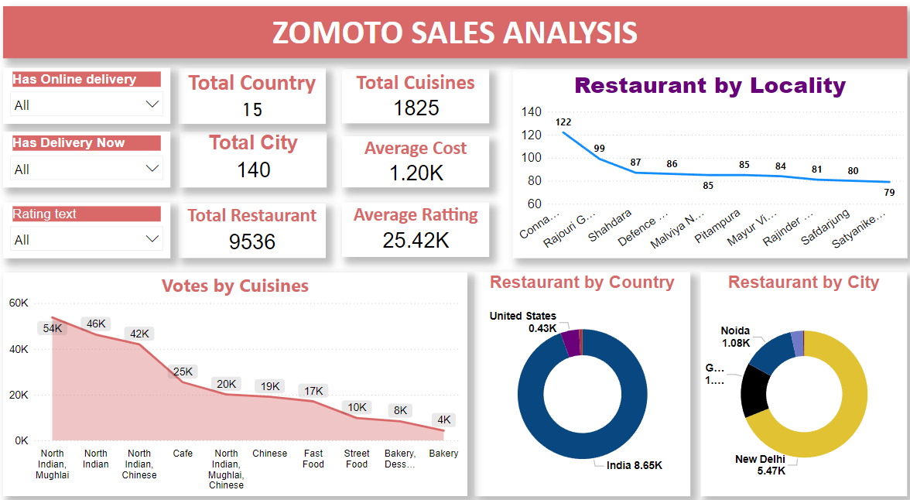

**Zomoto Sales Analysis Dashboard**

**Description:**  
This Zomoto Sales Analysis Dashboard provides insights into restaurant distribution, customer preferences, and sales trends based on Zomoto data. It visualizes key metrics, including restaurant counts, average costs, ratings, and cuisine popularity.  

**Key Features:**  
1. **Filters**  
   - Filter by online delivery availability, instant delivery options, and rating categories.  
2. **Summary Metrics**  
   - Total Countries: 15  
   - Total Cities: 140  
   - Total Cuisines: 1825  
   - Total Restaurants: 9536  
   - Average Cost: 1.20K  
   - Average Rating: 25.42K  
3. **Visualizations**  
   - **Restaurant by Locality:** Top localities with the highest number of restaurants.  
   - **Votes by Cuisines:** Popular cuisines with vote counts (e.g., North Indian and Mughlai dominate).  
   - **Restaurant by Country:** Country-wise distribution, with India having the majority of restaurants.  
   - **Restaurant by City:** City-wise distribution, highlighting New Delhi and Noida.  

**Technologies Used:**  
- Power BI

**Usage:**  
This dashboard helps stakeholders analyze restaurant performance, identify popular cuisines, and make data-driven decisions to improve sales and marketing strategies.  

**How to Run:**  
1. Open the dashboard file in the required visualization tool.  
2. Apply filters as needed to view insights.  

**Contributions:**  
Contributions and improvements are welcome! Submit pull requests for enhancements.  

